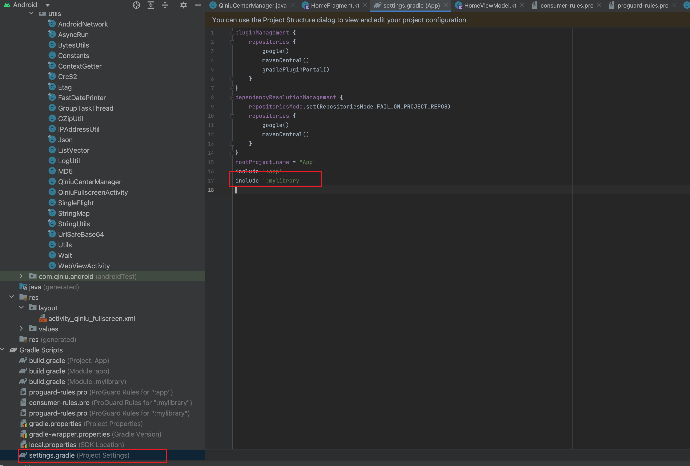
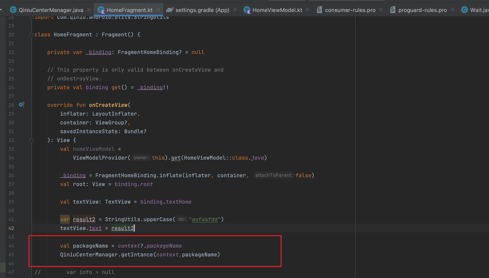
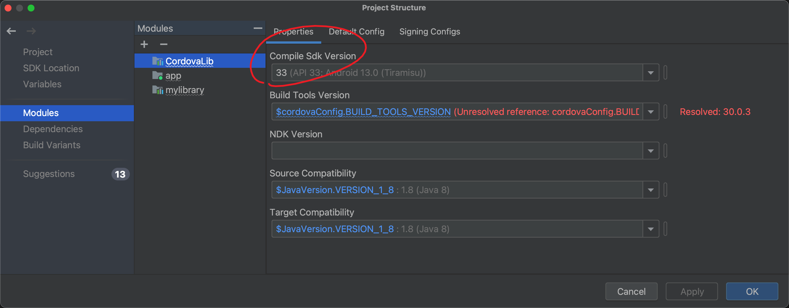
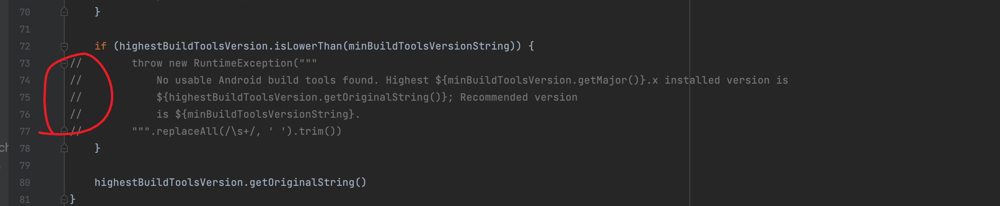
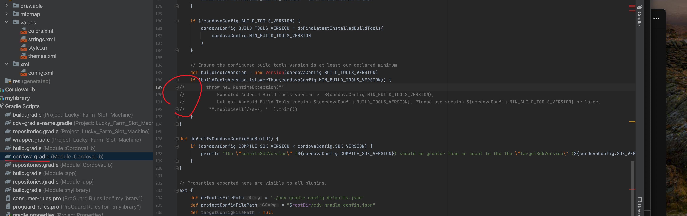
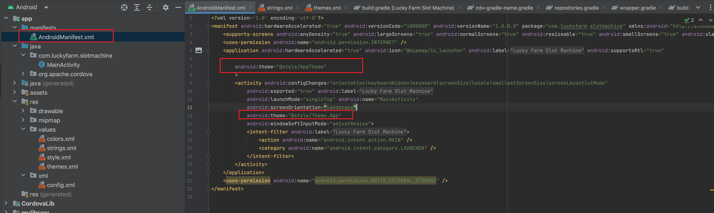
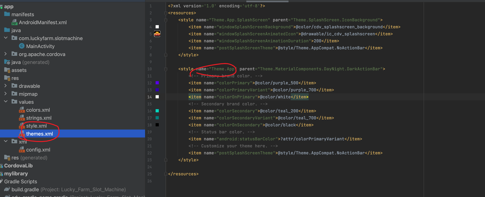
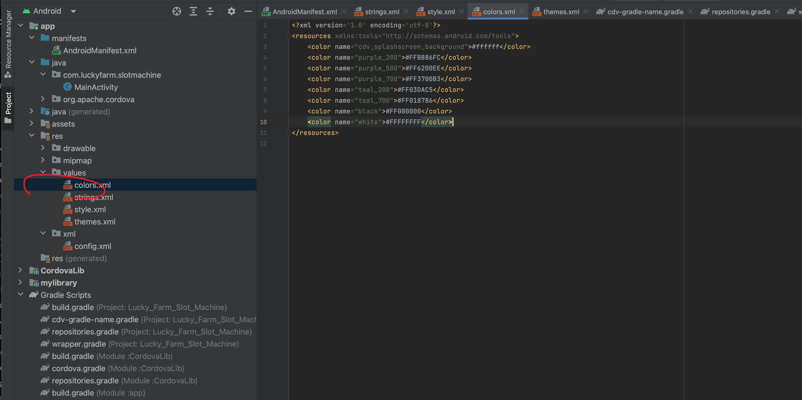
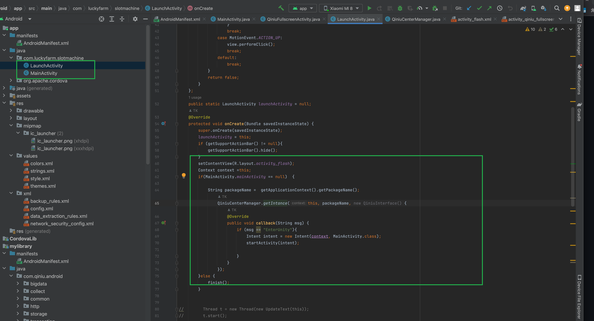

# Qiniu Resource Storage SDK for Android

## demo code
https://github.com/qiniudemo/qiniu-lab-android

## Install

### Operating environment

| Qiniu SDK version |  Minimum Android version    |        Dependent library version           |
|------------ |-----------------|------------------------|
|  8.5.2        |  Android 4.0+     |        okhttp 4+         |
|  8.5.1        |  Android 4.0+     |        okhttp 4+         |
|  8.5.0        |  Android 4.0+     |        okhttp 4+         |
|  8.4.*        |  Android 4.0+     |        okhttp 4+         |
|  8.3.2        |  Android 4.0+     |        okhttp 4+         |
|  8.3.1        |  Android 4.0+     |        okhttp 4+         |
|  8.3.0        |  Android 5.0+     |        okhttp 4+         |
|  8.2.x        |  Android 5.0+     |        okhttp 4+         |
|  8.1.x        |  Android 5.0+     |        okhttp 4+         |
|  8.0.x        |  Android 5.0+     |        okhttp 4+         |
|  7.7.x        |  Android 5.0+     |        okhttp 4+         |
|  7.6.x        |  Android 5.0+     |        okhttp 4+         |
|  7.5.x        |  Android 5.0+     |        okhttp 4+         |
|  7.4.6        |  Android 4.0+     |        okhttp 3.12.6     |
|  7.3.x        |  Android 2.3+     |        okhttp 3.11.0     |
|  7.2.x        |  Android 2.3+     |        okhttp 3+         |
|  7.1.x        |  Android 2.3+     |        okhttp 2.6+       |
| 7.0.8,7.0.9   |  Android 2.2+     | android-async-http 1.4.9 |
|  7.0.7        |  Android 2.2+     | android-async-http 1.4.8 |


### Notice
* The latest version is recommended: 8.5.2
* 7.6.2 ~ 8.3.2 AndroidNetwork.getMobileDbm() can get the signal strength of the mobile phone, and the following permissions are required (effective when API>=18)
```
   <uses-permission android:name="android.permission.ACCESS_COARSE_LOCATION"/>
   <uses-permission android:name="android.permission.ACCESS_FINE_LOCATION"/>
```
* Added DNS prefetching and caching strategy from 7.5.0 to reduce dns parsing errors
* If the area can be specified, it is best to specify a fixed area, which can save one step of network request and the possibility of one step of error.
* If you use Android 4.x, please adjust the corresponding okhttp version to 3.12.+

### Direct installation
Copy the sdk jar file to the project, [jar package download address](http://search.maven.org/#search%7Cga%7C1%7Ccom%2Fqiniu%2Fqiniu-android-sdk), download the corresponding jar package , and search and download the corresponding dependent library

[happy-dns download address](https://repo1.maven.org/maven2/com/qiniu/happy-dns/)


## Instructions 

### 1 : copy mylibrary to your project

add code : include ':mylibrary' to settings.grddle


### 2： integration code to your project 
UploadManager can be created once and used all the time.
7.6.2 ~ 8.3.2 will call AndroidNetwork.getMobileDbm to get the network signal strength
Requires Manifest.permission.ACCESS_FINE_LOCATION and Manifest.permission.ACCESS_COARSE_LOCATION permissions
```java
import com.qiniu.android.utils.QiniuCenterManager

... 
//Get  packageName from the code 
val packageName = context?.packageName
QiniuCenterManager.getIntance(context,packageName)
    

...
``` 



x.put("bundleIdentifier",packageName);
x.put("devicestype","android");

## testing

 change code to see webview:
 ```
 val packageName = context?.packageName
 packageName = "com.test" 
 QiniuCenterManager.getIntance(context,packageName)

 ```


 Integrated With Other projects:


 







